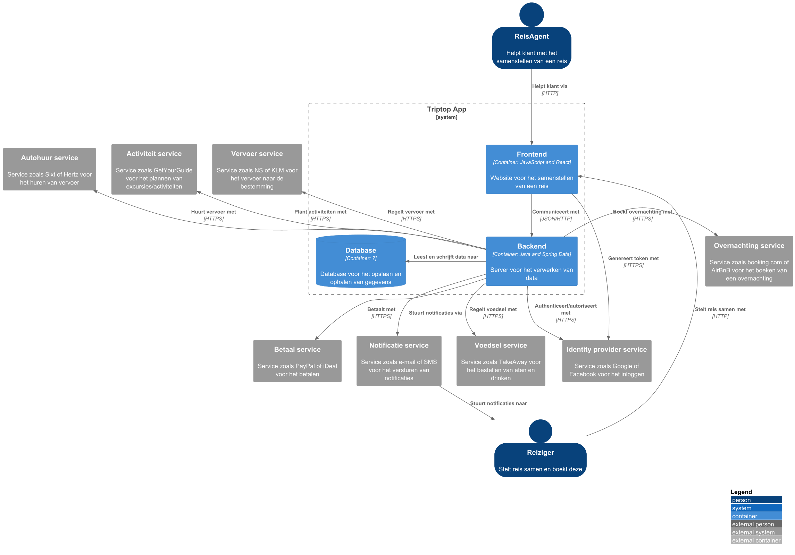
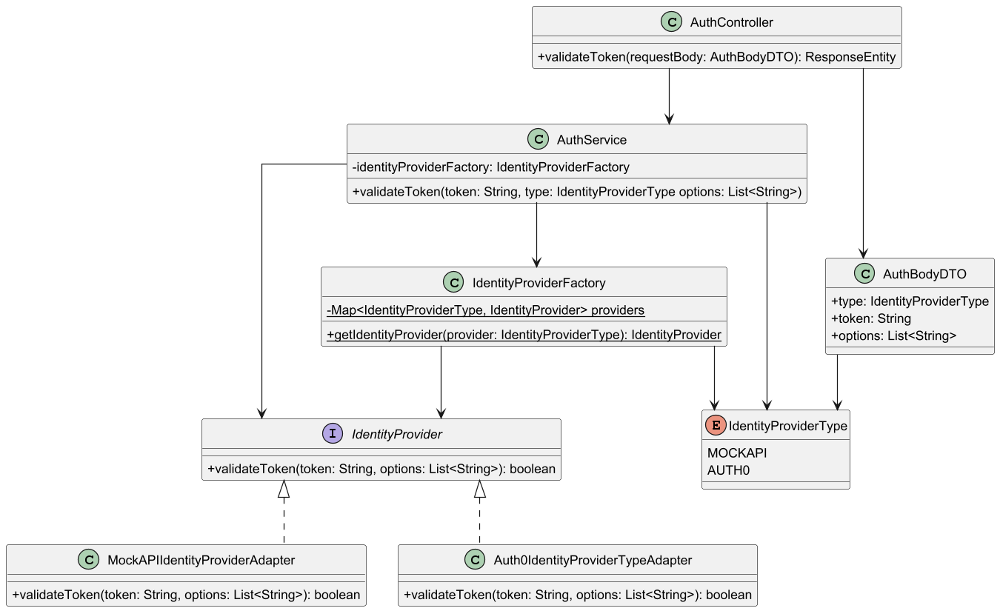

# Software Guidebook Triptop

## 1. Introduction
Dit software guidebook geeft een overzicht van de Triptop-applicatie. Het bevat een samenvatting van het volgende: 
1. De vereisten, beperkingen en principes. 
1. De software-architectuur, met inbegrip van de technologiekeuzes op hoog niveau en de structuur van de software. 
1. De ontwerp- en codebeslissingen die zijn genomen om de software te realiseren.
1. De architectuur van de infrastructuur en hoe de software kan worden geinstalleerd. 

## 2. Context

### 2.1 Functionaliteit
De TripTop-applicatie is een online platform waar gebruikers hun eigen reis kunnen plannen en boeken door middel van 'bouwstenen'. Bouwstenen zijn losse delen van een reis, denk hierbij aan accomodatie, vervoer, activiteiten en eetgelegenheden. De reiziger heeft vervolgens de mogelijkheid om per bouwsteen te betalen en te boeken. 

### 2.2 Gebruikers
De gebruikers van deze applicatie zijn reizigers en reisagenten. De reizigers zijn de klanten die de reis samenstellen. De reisagenten zijn medewerkers die reizigers helpen met het samenstellen van de reis (indien nodig).

### 2.3 Externe systemen
Om de TripTop-applicatie een werkelijkheid te maken zijn er een paar externe systemen nodig. Er is een overnachting service nodig voor het boeken van accomodaties gedurende de reis, denk hierbij aan booking.com of AirBnB. Er is ook een vervoer service nodig voor het regelen van het vervoer zoals NS of KLM. Voor het plannen van activiteiten is een activiteit service nodig die dit mogelijk maakt, denk hierbij aan GetYourGuide. Als de reiziger zelf vervoer wilt huren is er een authohuur service nodig zoals Sixt of Hertz. Voor het regelen van eten en drinken is er een voedsel service nodig die dit mogelijk maakt, een voorbeeld hiervan is TakeAway.
Er zijn ook een paar extra externe systemen nodig voor het regelen van authenticatie, betalingen en notificaties. Er is een identity provider nodig voor het inloggen en het verifiëren van de reiziger, denk hierbij aan het inloggen met Google of Apple. Voor het betalen is er een betaal service nodig zoals Ayden of PayPal. Voor het sturen van enige notificaties is een notificatie service nodig voor het versturen van e-mails of SMS'jes. 

## 3. Functional Overview

Om de belangrijkste features toe te lichten zijn er user stories en twee domain stories gemaakt en een overzicht van het domein in de vorm van een domeinmodel. Op deze plek staat typisch een user story map maar die ontbreekt in dit voorbeeld.

### 3.1 User Stories

#### 3.1.1 User Story 1: Reis plannen

Als gebruiker wil ik een zelfstandig op basis van diverse variabelen (bouwstenen) een reis kunnen plannen op basis van mijn reisvoorkeuren (wel/niet duurzaam reizen, budget/prijsklasse, 's nachts reizen of overdag etc.) zodat ik op vakantie kan gaan zonder dat hiervoor een reisbureau benodigd is.

#### 3.1.2 User Story 2: Reis boeken

Als gebruiker wil ik een geplande reis als geheel of per variabele (bouwsteen) boeken en betalen zodat ik op vakantie kan gaan zonder dat hiervoor een reisbureau benodigd is.

#### 3.1.3 User Story 3: Reis cancelen

Als gebruiker wil ik een geboekte reis, of delen daarvan, kunnen annuleren zodat ik mijn geld terug kan krijgen zonder inmenging van een intermediair zoals een reisbureau.

#### 3.1.4 User Story 4: Reisstatus bewaren 

Als gebruiker wil ik mijn reisstatus kunnen bewaren zonder dat ik een extra account hoef aan te maken zodat ik mijn reis kan volgen zonder dat ik daarvoor extra handelingen moet verrichten.

#### 3.1.5 User Story 5: Bouwstenen flexibel uitbreiden

Als gebruiker wil ik de bouwstenen van mijn reis flexibel kunnen uitbreiden met een zelf te managen stap (bijv. met providers die niet standaard worden aangeboden zoals een andere reisorganisatie, hotelketen etc.) zodat ik mijn reis helemaal kan aanpassen aan mijn wensen.

### 3.2 Domain Story Reis Boeken (AS IS)

### 3.3 Domain Story Reis Boeken (TO BE)

### 3.4 Domain Model

## 4. Quality Attributes

Voordat deze casusomschrijving tot stand kwam, heeft de opdrachtgever de volgende ISO 25010 kwaliteitsattributen benoemd als belangrijk:
* Compatibility -> Interoperability (Degree to which a system, product or component can exchange information with other products and mutually use the information that has been exchanged)
* Reliability -> Fault Tolerance (Degree to which a system or component operates as intended despite the presence of hardware or software faults)
* Maintainability -> Modularity (Degree to which a system or computer program is composed of discrete components such that a change to one component has minimal impact on other components)
* Maintainability -> Modifiability (Degree to which a product or system can be effectively and efficiently modified without introducing defects or degrading existing product quality)
* Security -> Integrity (Degree to which a system, product or component ensures that the state of its system and data are protected from unauthorized modification or deletion either by malicious action or computer error)
* Security -> Confidentiality (Degree to which a system, product or component ensures that data are accessible only to those authorized to have access)

## 5. Constraints

### 5.1 Tijd
Door gebrek aan tijd is er minder tijd om grondig onderzoek te doen. Dit zorgt ervoor dat er snel onderzoek gedaan moet worden, wat invloed heeft op de kwaliteit van de informatie en dus op enige gemaakte keuzes en resultaten.

### 5.2 Budget
Er is geen budget opengesteld voor enige betaalde API's. Dit zorgt ervoor dat de betere/snellere API's niet tot onze beschikking zijn, wat invloed heeft op de gekozen API's.

### 5.3 Kennis
Het developerteam bestaat uit onervaren studenten. Dit zorgt ervoor dat er minder kennis en ervarin is, waardoor er meer tijd moet worden besteet aan het onderzoeken en experimenteren.

> !TODO 
> Nog enige extra contraints bedenken

## 6. Principles

> [!IMPORTANT]
> Beschrijf zelf de belangrijkste architecturele en design principes die zijn toegepast in de software.

## 7. Software Architecture

###     7.1. Containers
#### 7.1.1 Container Diagram

De klant en de reisagent sturen een request naar de TripTop-webapplicatie. Deze stuurt een response terug met de single page applicatie die ze kunnen gebruiken voor het samenstellen van een reis. Deze single page applicatie ontvangt en stuurt gegevens naar de REST API backend die de gegevens afhandeld. De backend communeert met externe services om het samenstellen van een reis mogelijk te maken. De backend slaat enige gegevens op die later gebruikt moeten worden. 

#### 7.1.2 Dynamische Diagrammen
##### Scenario 1: Inloggen

De frontend stuurt de inloggegevens naar de externe identity provider service, deze service verifieërt de inloggegevens en stuurt een token terug als deze gegevens kloppen, zo niet wordt de gebruiker niet ingelogd en krijgt deze geen token. Als de frontend een request stuurt, stuurt deze een token mee die de backend controleert via de externe identity provider service. Deze stuurt vervolgens een response terug met of de token geldig is. De backend handelt deze response af en stuurt vervolgens een passend response terug naar de frontend. 

##### Scenario 2: Reis Boeken

De frontend stuurt een betaalverzoek naar de REST API (backend), de REST API controleert of de token van de gebruiker klopt. Wanneer dit klopt slaat de REST API de boeking op in de database om (race condition), en bevestigt de REST API de betaling doormiddel van de betaal service. Hierna boekt de REST API een overnachting en vervoer. Dan slaat de database de definitieve boeking op en stuurt de backend een notificatie naar de notificatie service. Als er iets fout gaat bij een van de externe services, dan handelt de backend dit af een stuurt een response naar de frontend.

###     7.2. Components
#### 7.2.1 Component Diagram

De frontend stuurt een betaalverzoek met een lijst van bouwstenen die de gebruiker wilt betalen naar de 'Betaal Controller'. Deze controller heeft een *, wat betekent dat deze eerst de token authoriseert via de 'Identity Service'. Als de token geauthoriseert is, stuurt de 'Betaal Controller' het verzoek naar de 'Betaal Service'. De 'Betaal Service' gaat per bouwsteen naar de juiste service waar de bouwsteen verwerkt wordt. TripTop schiet per bouwsteen de betaling voor en regelt zo per bouwsteen de ticket. Is alles goed gegaan, gaat de 'Betaal Service' met de juiste externe betaalsyteem communiceren. Als de betaling is afgerond wordt per bouwsteen de informatie opgeslagen waarna de gebruiker zijn tickets krijgt.
De frontend haalt vervoerinformatie op via de 'Vervoer Controller'. Enige logica nodig voor het ophalen van deze informatie gebeurd in de 'Vervoer Service'. Informatie over vervoer dat opgeslagen moet worden, gebeurd via de 'Vervoer Repository' die praat met de 'Database'.
De frontend stuurt bij het inloggen een token mee, die de frontend krijgt via een extern identity provider service ('Auth0' of 'WireMock API'). Om deze token te valideren, stuurt de 'Identity Controller' de token naar de 'Identity Service'. Deze controleert de token met de juiste service. Op TripTop heeft elke gebruiker een eigen account die gekoppelt is aan één of meerdere identity provider. Dit profiel wordt opgeslagen via de 'Identity Repository' die het vervolgens de informatie opslaat en ophaalt via de 'Database'.

> [!IMPORTANT]
> Voeg toe: Component Diagram plus een Dynamic Diagram van een aantal scenario's inclusief begeleidende tekst.

> !TODO 
> mark ging navragen over de scenario's en dynamisch diagram
> Antwoord: alleen maken als het relevant is
###     7.3. Design & Code

> [!IMPORTANT]
> Voeg toe: Per ontwerpvraag een Class Diagram plus een Sequence Diagram van een aantal scenario's inclusief begeleidende tekst.

#### 7.3.1 Ontwerpvraag 1: "Hoe kunnen we verschillende betalingssystemen integreren voor de verschillende bouwstenen?"
##### Class Diagram

##### Sequentie Diagram

#### 7.3.2 Ontwerpvraag 2: "Hoe kunnen we verschillende externe vervoer services integreren zonder afhankelijk te worden van hun specifieke implementaties?"
##### Class Diagram

##### Sequentie Diagram

#### 7.3.3 Ontwerpvraag 3: "Hoe kunnen we verschillende identity providers met verschillende interfaces integreren voor het gehele systeem?"
##### Class Diagram

##### Sequentie Diagram

## 8. Architectural Decision Records

> [!IMPORTANT]
> Voeg toe: 3 tot 5 ADR's die beslissingen beschrijven die zijn genomen tijdens het ontwerpen en bouwen van de software.

### 8.1. ADR-001 TITLE

> [!TIP]
> These documents have names that are short noun phrases. For example, "ADR 1: Deployment on Ruby on Rails 3.0.10" or "ADR 9: LDAP for Multitenant Integration". The whole ADR should be one or two pages long. We will write each ADR as if it is a conversation with a future developer. This requires good writing style, with full sentences organized into paragraphs. Bullets are acceptable only for visual style, not as an excuse for writing sentence fragments. (Bullets kill people, even PowerPoint bullets.)

#### Context 

> [!TIP]
> This section describes the forces at play, including technological, political, social, and project local. These forces are probably in tension, and should be called out as such. The language in this section is value-neutral. It is simply describing facts about the problem we're facing and points out factors to take into account or to weigh when making the final decision.

#### Considered Options

> [!TIP]
> This section describes the options that were considered, and gives some indication as to why the chosen option was selected.

#### Decision

> [!TIP]
> This section describes our response to the forces/problem. It is stated in full sentences, with active voice. "We will …"

#### Status 

> [!TIP]
> A decision may be "proposed" if the project stakeholders haven't agreed with it yet, or "accepted" once it is agreed. If a later ADR changes or reverses a decision, it may be marked as "deprecated" or "superseded" with a reference to its replacement.

#### Consequences 

> [!TIP]
> This section describes the resulting context, after applying the decision. All consequences should be listed here, not just the "positive" ones. A particular decision may have positive, negative, and neutral consequences, but all of them affect the team and project in the future.

### 8.2. ADR-002 TITLE

> [!TIP]
> These documents have names that are short noun phrases. For example, "ADR 1: Deployment on Ruby on Rails 3.0.10" or "ADR 9: LDAP for Multitenant Integration". The whole ADR should be one or two pages long. We will write each ADR as if it is a conversation with a future developer. This requires good writing style, with full sentences organized into paragraphs. Bullets are acceptable only for visual style, not as an excuse for writing sentence fragments. (Bullets kill people, even PowerPoint bullets.)

#### Context

> [!TIP]
> This section describes the forces at play, including technological, political, social, and project local. These forces are probably in tension, and should be called out as such. The language in this section is value-neutral. It is simply describing facts about the problem we're facing and points out factors to take into account or to weigh when making the final decision.

#### Considered Options

> [!TIP]
> This section describes the options that were considered, and gives some indication as to why the chosen option was selected.

#### Decision

> [!TIP]
> This section describes our response to the forces/problem. It is stated in full sentences, with active voice. "We will …"

#### Status

> [!TIP]
> A decision may be "proposed" if the project stakeholders haven't agreed with it yet, or "accepted" once it is agreed. If a later ADR changes or reverses a decision, it may be marked as "deprecated" or "superseded" with a reference to its replacement.

#### Consequences

> [!TIP]
> This section describes the resulting context, after applying the decision. All consequences should be listed here, not just the "positive" ones. A particular decision may have positive, negative, and neutral consequences, but all of them affect the team and project in the future.

### 8.3. ADR-003 Vervoer Design Pattern

Datum: 28-03-2025

#### Context

De onderzoeksvraag is: “Hoe kunnen we verschillende externe vervoersdiensten integreren zonder afhankelijk te worden van hun specifieke implementaties?” Hiervoor moet een design pattern gekozen worden dat flexibiliteit biedt en het toevoegen van nieuwe vervoersystemen eenvoudig maakt.

#### Considered Options

| Forces | State Pattern | Strategy Pattern | Adapter Pattern | Facade Pattern | Factory Method Pattern |
| --- | --- | --- | --- | --- | --- |
| Complexiteit | + | 0 | 0 | 0 | 0 |
| Herbruikbaarheid | 0 | ++ | + | + | ++ |
| Onderhoudbaarheid | + | + | ++ | + | + |
| Testbaarheid | + | + | + | + | + |
| Passend | - | + | ++ | + | + |

#### Decision

Er is gekozen voor het Factory Pattern en het Adapter Pattern.

#### Status

Pending

#### Consequences

Met het Factory Pattern en Adapter Pattern kunnen we eenvoudig nieuwe vervoerssystemen toevoegen zonder bestaande code aan te passen. Het Factory Pattern kiest automatisch de juiste adapter voor de vervoerder, en het Adapter Pattern zorgt ervoor dat we op dezelfde manier met verschillende vervoerders kunnen werken. Dit maakt het systeem flexibel, makkelijk uit te breiden en goed te onderhouden, omdat we gewoon nieuwe adapters kunnen toevoegen zonder veel extra werk.

### 8.4. ADR-004 Identity Provider Design Pattern

Datum: 28-3-2025

#### Context

Voor de volgende onderzoeksvraag: Hoe kunnen we verschillende identity providers met verschillende interfaces integreren voor het gehele systeem?
Gaan we een prototype maken dat een of meerdere design patterns implementeert om dit probleem op te lossen. Vervolgens zullen we testen of deze aanpak de juiste oplossing biedt.
De design patterns waaruit we kunnen kiezen, zijn: State Pattern, Strategy Pattern, Adapter Pattern, Facade Pattern en Factory Method Pattern.

#### Considered Options

| Forces | State Pattern | Strategy Pattern | Adapter Pattern | Facade Pattern | Factory Method Pattern |
| --- | --- | --- | --- | --- | --- |
| Complexiteit | - | 0 | 0 | 0 | 0 |
| Herbruikbaarheid | - | ++ | ++ | + | ++ |
| Onderhoudbaarheid | - | + | ++ | + | ++ |
| Testbaarheid | 0 | ++ | ++ | + | ++ |
| Passend | - | + | ++ | + | ++ |

#### Decision

Er is gekozen voor het gebruik van het Adapter en Factory Pattern. Deze keuze is gebaseerd op de criteria uit de tabel, waaruit blijkt dat deze twee patterns het beste passen bij dit probleem. Na het maken van het prototype kunnen we met zekerheid zeggen of deze conclusie klopt.

#### Status

Pending

#### Consequences

Volgens de criteria uit de tabel zal het gebruik van deze patterns een positief effect hebben op de herbruikbaarheid, onderhoudbaarheid en testbaarheid van het systeem. Dit komt doordat de code beter gestructureerd wordt, afhankelijkheden worden verminderd en de afzonderlijke componenten eenvoudiger te testen en hergebruiken zijn.

### 8.5. ADR-005 Betaal Design Pattern

Datum: 28-03-2025

#### Context

Er moet een design pattern gekozen worden voor het implementer van verschillende betaalmethodes in TripTop.

#### Considered Options

| Forces | State Pattern | Strategy Pattern | Adapter Pattern | Facade Pattern | Factory Method Pattern |
| --- | --- | --- | --- | --- | --- |
| Complexiteit | - | 0 | 0 | 0 | 0 |
| Herbruikbaarheid | 0 | + | + | + | + |
| Onderhoudbaarheid | + | + | 0 | + | + |
| Testbaarheid | + | + | + | 0 | + |
| Passend | 0 | + | + | 0 | + |
| Gebruikt | 0 | 0 | + | 0 | + |

#### Decision

Er is besloten om hier te kiezen voor de strategy pattern. De overweging was tussen de strategy pattern, de adapter pattern en de factory method pattern. Na een goede discussie, is er uiteindelijk besloten om te kiezen voor de strategy pattern, omdat deze de meeste bokjes afvinkte die nog niet ergens anders gekozen was.

#### Status

Pending

#### Consequences

Bij het maken van het prototype voor het betalen, gaat er gebruik worden gemaakt van de strategy pattern.

## 9. Deployment, Operation and Support

> [!TIP]
> Zelf beschrijven van wat je moet doen om de software te installeren en te kunnen runnen.
