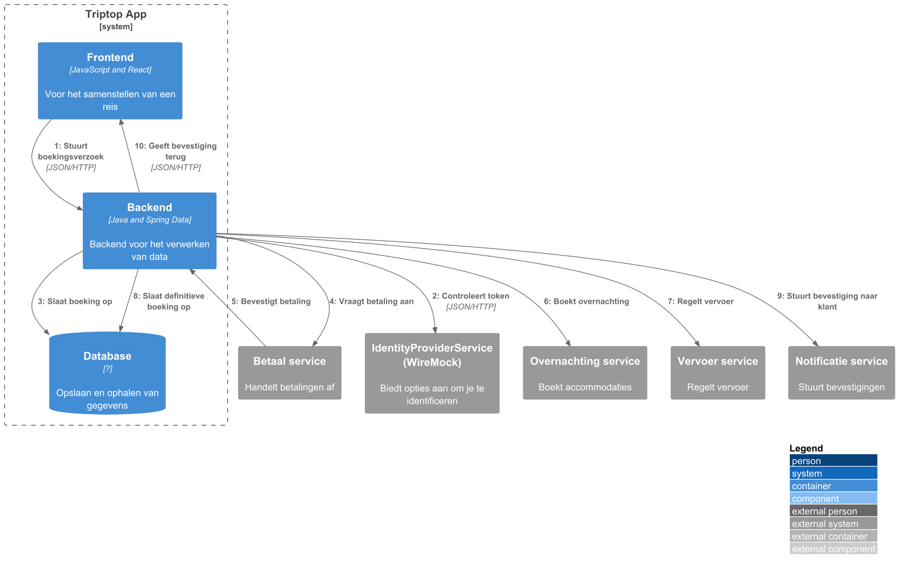
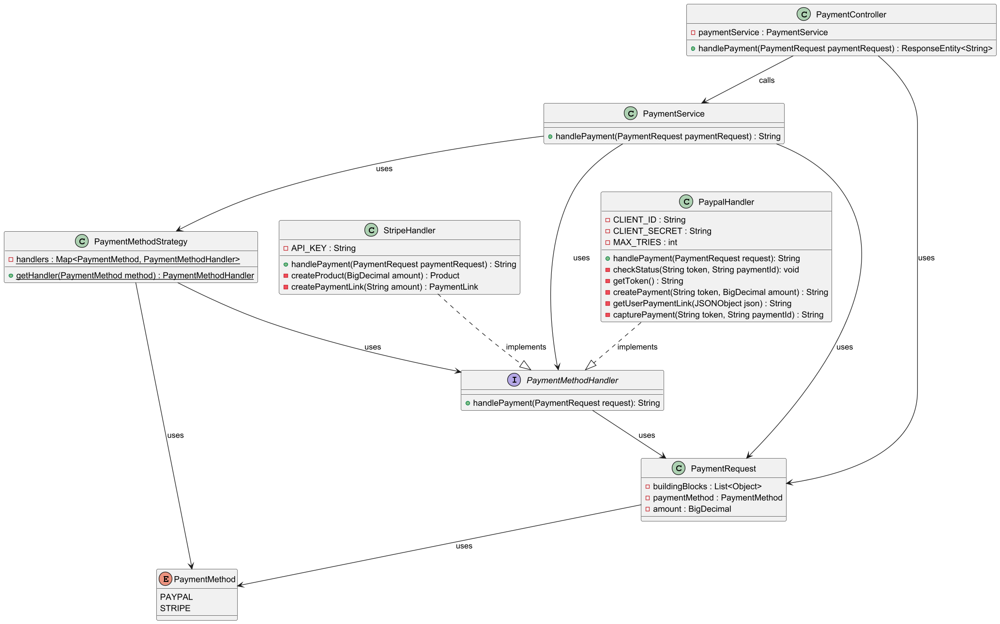
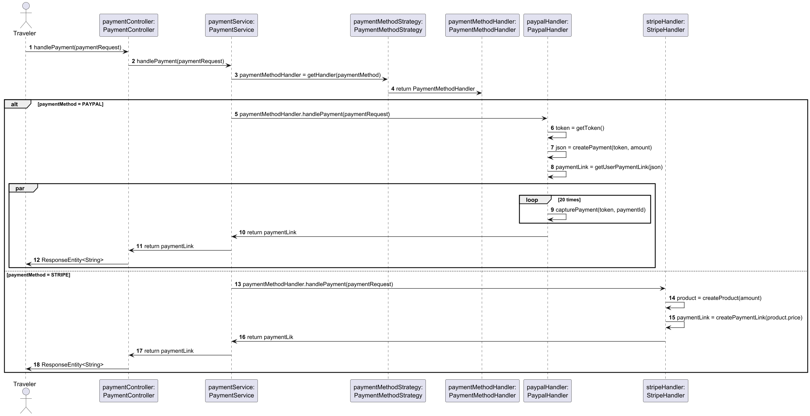
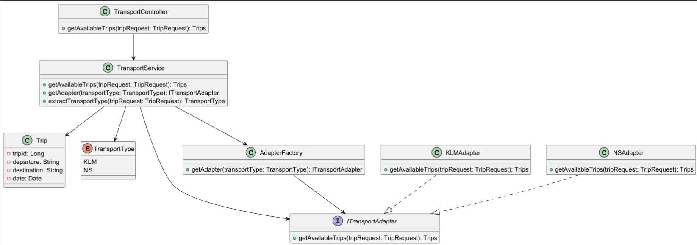
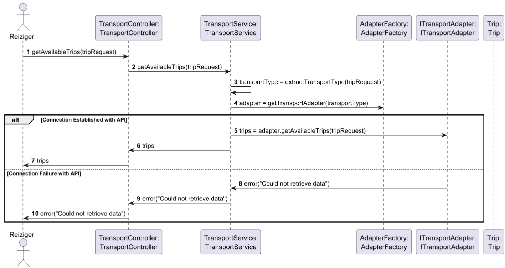

# Software Guidebook Triptop

## 1. Introduction

Dit software guidebook geeft een overzicht van de Triptop-applicatie. Het bevat een samenvatting van het volgende:

1. De vereisten, beperkingen en principes.
1. De software-architectuur, met inbegrip van de technologiekeuzes op hoog niveau en de structuur van de software.
1. De ontwerp- en codebeslissingen die zijn genomen om de software te realiseren.
1. De architectuur van de infrastructuur en hoe de software kan worden geinstalleerd.

## 2. Context


### 2.1 Functionaliteit

De TripTop-applicatie is een online platform waar gebruikers hun eigen reis kunnen plannen en boeken door middel van '
bouwstenen'. Bouwstenen zijn losse delen van een reis, denk hierbij aan accomodatie, vervoer, activiteiten en
eetgelegenheden. De reiziger heeft vervolgens de mogelijkheid om per bouwsteen te betalen en te boeken.

### 2.2 Gebruikers

De gebruikers van deze applicatie zijn reizigers en reisagenten. De reizigers zijn de klanten die de reis samenstellen.
De reisagenten zijn medewerkers die reizigers helpen met het samenstellen van de reis (indien nodig).

### 2.3 Externe systemen

Om de TripTop-applicatie een werkelijkheid te maken zijn er een paar externe systemen nodig. Er is een overnachting
service nodig voor het boeken van accomodaties gedurende de reis, denk hierbij aan booking.com of AirBnB. Er is ook een
vervoer service nodig voor het regelen van het vervoer zoals NS of KLM. Voor het plannen van activiteiten is een
activiteit service nodig die dit mogelijk maakt, denk hierbij aan GetYourGuide. Als de reiziger zelf vervoer wilt huren
is er een authohuur service nodig zoals Sixt of Hertz. Voor het regelen van eten en drinken is er een voedsel service
nodig die dit mogelijk maakt, een voorbeeld hiervan is TakeAway.
Er zijn ook een paar extra externe systemen nodig voor het regelen van authenticatie, betalingen en notificaties. Er is
een identity provider nodig voor het inloggen en het verifiëren van de reiziger, denk hierbij aan het inloggen met
Google of Apple. Voor het betalen is er een betaal service nodig zoals Ayden of PayPal. Voor het sturen van enige
notificaties is een notificatie service nodig voor het versturen van e-mails of SMS'jes.

## 3. Functional Overview

Om de belangrijkste features toe te lichten zijn er user stories en twee domain stories gemaakt en een overzicht van het
domein in de vorm van een domeinmodel. Op deze plek staat typisch een user story map maar die ontbreekt in dit
voorbeeld.

### 3.1 User Stories

#### 3.1.1 User Story 1: Reis plannen

Als gebruiker wil ik een zelfstandig op basis van diverse variabelen (bouwstenen) een reis kunnen plannen op basis van
mijn reisvoorkeuren (wel/niet duurzaam reizen, budget/prijsklasse, 's nachts reizen of overdag etc.) zodat ik op
vakantie kan gaan zonder dat hiervoor een reisbureau benodigd is.

#### 3.1.2 User Story 2: Reis boeken

Als gebruiker wil ik een geplande reis als geheel of per variabele (bouwsteen) boeken en betalen zodat ik op vakantie
kan gaan zonder dat hiervoor een reisbureau benodigd is.

#### 3.1.3 User Story 3: Reis cancelen

Als gebruiker wil ik een geboekte reis, of delen daarvan, kunnen annuleren zodat ik mijn geld terug kan krijgen zonder
inmenging van een intermediair zoals een reisbureau.

#### 3.1.4 User Story 4: Reisstatus bewaren

Als gebruiker wil ik mijn reisstatus kunnen bewaren zonder dat ik een extra account hoef aan te maken zodat ik mijn reis
kan volgen zonder dat ik daarvoor extra handelingen moet verrichten.

#### 3.1.5 User Story 5: Bouwstenen flexibel uitbreiden

Als gebruiker wil ik de bouwstenen van mijn reis flexibel kunnen uitbreiden met een zelf te managen stap (bijv. met
providers die niet standaard worden aangeboden zoals een andere reisorganisatie, hotelketen etc.) zodat ik mijn reis
helemaal kan aanpassen aan mijn wensen.

### 3.2 Domain Story Reis Boeken (AS IS)


### 3.3 Domain Story Reis Boeken (TO BE)


### 3.4 Domain Model


## 4. Quality Attributes

Voordat deze casusomschrijving tot stand kwam, heeft de opdrachtgever de volgende ISO 25010 kwaliteitsattributen benoemd
als belangrijk:

* Compatibility -> Interoperability (Degree to which a system, product or component can exchange information with other
  products and mutually use the information that has been exchanged)
* Reliability -> Fault Tolerance (Degree to which a system or component operates as intended despite the presence of
  hardware or software faults)
* Maintainability -> Modularity (Degree to which a system or computer program is composed of discrete components such
  that a change to one component has minimal impact on other components)
* Maintainability -> Modifiability (Degree to which a product or system can be effectively and efficiently modified
  without introducing defects or degrading existing product quality)
* Security -> Integrity (Degree to which a system, product or component ensures that the state of its system and data
  are protected from unauthorized modification or deletion either by malicious action or computer error)
* Security -> Confidentiality (Degree to which a system, product or component ensures that data are accessible only to
  those authorized to have access)

## 5. Constraints

### 5.1 Tijd

Door gebrek aan tijd is er minder tijd om grondig onderzoek te doen. Dit zorgt ervoor dat er snel onderzoek gedaan moet
worden, wat invloed heeft op de kwaliteit van de informatie en dus op enige gemaakte keuzes en resultaten.

### 5.2 Budget

Er is geen budget opengesteld voor enige betaalde API's. Dit zorgt ervoor dat de betere/snellere API's niet tot onze
beschikking zijn, wat invloed heeft op de gekozen API's.

### 5.3 Kennis

Het developer team bestaat uit onervaren studenten. Dit zorgt ervoor dat er minder kennis en ervarin is, waardoor er
meer tijd moet worden besteed aan het onderzoeken en experimenteren.

## 6. Principles

In de software is 'Programming to an interface' toegepast. Dit is toegepast omdat er veel verschillende externe
systemen zijn die met elkaar moeten communiceren. Door een interface te gebruiken, kunnen we de implementatie van
deze systemen makkelijker scheiden en later te gebruiken. Dit zorgt er ook voor dat er later makkelijker nieuwe
systemen kunnen worden toegevoegd. Dit principe is bijvoorbeeld gebruikt bij de verschillende betaalsystemen.
Door gebruik te maken van 'Programming to an interface' is er ook gebruik kunnen worden gemaakt van 'Dependency
Inversion'. Dit is toegepast omdat er veel verschillende externe systemen zijn die met elkaar moeten communiceren. Door
de software zo te structureren, kunnen we de afhankelijkheden tussen de verschillende componenten verminderen. Dit
zorgt er ook voor dat de software makkelijker te onderhouden en uit te breiden is. Dit principe is bijvoorbeeld
toegepast bij de verschillende externe betaalsystemen. Er is een interface gemaakt voor het afhandelen van een
betaling. De verschillende handler klasse implementeren deze interface. Bij het regelen van een betaling wordt een
betaalmethode meegegeven en wordt een Handler klasse gedeclareerd en geïnitialiseerd met de juiste handler.

Ook is er gebruik gemaakt van 'Single Responsibility Principle'. Dit is toegepast omdat er later mogelijk nieuwe
externe systemen moeten worden toegevoegd. Door de software zo te structureren, kunnen we de verantwoordelijkheden
tussen de verschillende componenten scheiden. Dit zorgt er ook voor dat de software makkelijker te onderhouden en
uit te breiden is. Dit principe is bijvoorbeeld toegepast bij de verschillende externe betaalsystemen. Er is een
aparte handler klasse gemaakt voor elke betaalsysteem. Ook is dit terug te vinden bij de transport klassen, waarbij de
externe vervoer api's alle een eigen adapter klasse hebben.

Het Open/Closed Principle komt terug in de identity providers, omdat je nieuwe providers kunt toevoegen zonder de
huidige code aan te passen.
Hierdoor blijft de bestaande werking intact, terwijl het systeem toch flexibel uitbreidbaar is.

Ook het principe Encapsulate What Varies is verwerkt, zowel bij de betalingsinterface als de identity providers.
Neem bijvoorbeeld betalingen: elke betaalmethode heeft z’n eigen logica, maar doordat dit afgeschermd is, heeft een
aanpassing geen gevolgen voor de rest van het systeem.
Hetzelfde zie je bij identity providers, waar elke provider een eigen authenticatieproces kan hebben. Ook bij de
transporten werkt dit zo, als je bij NS iets aanpast zal dat niks veranderen bij KLM bijvoorbeeld.

Door deze variabele logica te isoleren, kun je nieuwe betaalmethoden, providers of transporten toevoegen of bestaande
aanpassen zonder dat dit andere onderdelen beïnvloedt.
Dit houdt de code flexibel en schaalbaar, wat toekomstige uitbreidingen een stuk eenvoudiger maakt.

## 7. Software Architecture

### 7.1. Containers

#### 7.1.1 Container Diagram


Dit diagram is bedoeld om meer inzicht te krijgen over hoe de TripTop applicatie van binnen in communiceert met
elkaar en de externe services.
De klant en reisagent bezoeken beide de frontend webapplicatie. Deze frontend is een single page applicatie gemaakt met
React.js. De frontend gebruikt een identity provider om de gebruiker in te loggen en een token aan te maken, die
vervolgens in de backend geverifiëerd wordt.
Enige andere verzoeken gaan naar de backend gemaakt met Java en Spring Data. De backend communiceert
met externe services voor het ophalen/verwerken van data. De reden waarom deze andere externe services niet via de
frontend gaan, is omdat deze services meestal gebruik maken van gevoelige informatie over de applicatie, meestal een
'API-key'. Gaan dit via de frontend, dan zou deze 'API-key' zichtbaar kunnen zijn en misbruikt kunnen worden door de
klant.
De backend slaat data op in een database die nog niet is gekozen, omdat er nog niet genoeg informatie is over de
manier van het opslaan van de data. Er is hier gekozen voor het werken met React en Spring Data omdat de groep hier
ervaring mee heeft en er niet veel tijd is voor het maken van de architectuur.

#### 7.1.2 Dynamische Diagrammen

##### Scenario 1: Inloggen


De frontend stuurt de inloggegevens naar de externe identity provider service, deze service verifieërt de inloggegevens
en stuurt een token terug als deze gegevens kloppen, zo niet wordt de gebruiker niet ingelogd en krijgt deze geen token.
Als de frontend een request stuurt, stuurt deze een token mee die de backend controleert via de externe identity
provider service. Deze stuurt vervolgens een response terug met of de token geldig is. De backend handelt deze response
af en stuurt vervolgens een passende response terug naar de frontend.
Er is voor deze manier gekozen, omdat nu de klant met verschillende accounts kan inloggen op zijn/haar
TripTop-profiel. Deze API gaat via de frontend omdat deze externe services meestal een redirect link gebruiker die
de gebruiker naar de inlogpagina stuurt. Gaat dit via de backend dan moet de server kijken voor welke login methode
is gekozen, vervolgens een redirect link aanmaken, deze link terugsturen en dan moet de website de gebruiker
redirecten naar de inlogpagina.

##### Scenario 2: Reis Boeken



De frontend stuurt een betaalverzoek naar de backend, de backend controleert of de token van de
gebruiker klopt. Als dit klopt, slaat de backend alvast de boeking op in de database. Er is hiervoor gekozen omdat
we ervoor willen zorgen dat niemand anders dezelfde boekingen kunnen maken terwijl een klant de boeking aan het
betalen is. Vervolgens bevestigt de backend de betaling via de betaalservice. Hierna boekt de backend een 
overnachting en vervoer. Daarna slaat de database de definitieve boeking op en stuurt de backend
een notificatie naar de notificatie service. Als er iets fout gaat bij een van de externe services, dan handelt de  
backend dit af een stuurt een response naar de frontend.
Er is in deze flow gekozen om de klant eerst te laten betalen naar TripTop en dat daarna TripTop de boekingen 
plaatst. Dit is gedaan omdat TripTop dan het geld al heeft om de boekingen te plaatsen. Mocht er iets misgaan en 
gaat de betaling niet door, dan kan TripTop makkelijk alles annuleren en het geld terugstorten.

### 7.2. Components

#### 7.2.1 Component Diagram


De frontend stuurt een betaalverzoek met een lijst van bouwstenen die de gebruiker wil betalen naar de 'Betaal
Controller'. Deze controller heeft een *, wat betekent dat deze eerst de token autoriseert via de 'Identity Service'.
Er is gekozen voor deze manier omdat het zo de gebruiker zelf kan aanvinken op de frontend met wat hij/zij wil 
betalen en zo kunnen we makkelijk op de backend de betaling regelen.
Als de token geautoriseerd is, stuurt de 'Betaal Controller' het verzoek naar de 'Betaal Service'. De 'Betaal Service'
gaat per bouwsteen naar de juiste service waar de bouwsteen alvast opgeslagen wordt. Vervolgens gaat de 'Betaal 
Service' naar de betaalmethode die de klant heeft geselecteerd en betaalt de klant de bouwstenen.
Heeft de klant betaalt, dan gaat de 'Betaal Service' per bouwsteen naar de juiste service en boekt deze. Als alles 
is geboekt worden alle bouwstenen definitief opgeslagen, waarna de klant een bevestiging krijgt van zijn boekingen.
De frontend haalt vervoer informatie op via de 'Vervoer Controller'. Enige logica nodig voor het ophalen van deze
informatie gebeurd in de 'Vervoer Service'. Informatie over vervoer dat opgeslagen moet worden, gebeurd via de 'Vervoer
Repository' die praat met de database.
De frontend stuurt bij het inloggen een token mee die de frontend krijgt via een externe identity provider ('Auth0' 
of 'WireMock API'). Om deze token te valideren, stuurt de 'Identity Controller' de token naar de 'Identity
Service'. Deze controleert de token met de juiste service. Op TripTop heeft elke gebruiker een eigen account die
gekoppeld is aan één of meerdere identity providers. Dit profiel wordt opgeslagen via de 'Identity Repository' die het
vervolgens de informatie opslaat en ophaalt via de 'Database'. Er is hier gekozen voor deze manier, omdat we zo de 
verschillende boekingen per profiel kunnen opslaan en zo kan de klant zelf kiezen met welke manier die wil inloggen.

### 7.3. Design & Code

#### 7.3.1 Ontwerpvraag 1: "Hoe kunnen we verschillende betalingssystemen integreren voor de verschillende bouwstenen?"

##### Class Diagram



De 'PaymentController' krijgt het initiële request van de reiziger. Deze krijgt een 'PaymentRequest' in de
'handlePayment' waarin de 'PaymentService' wordt aangeroepen. De 'PaymentService' roept vervolgens
'PaymentMethodStrategy' aan voor het verkrijgen van de juiste handler. Hierna wordt de handler aangeroepen en wordt
verdere logica verwerkt in een klasse die 'PaymentMethodHandler' implementeert.
Ik heb gekozen om de 'Strategy Pattern' te gebruiken, omdat er verschillende soorten betaalmethode zijn en door een 
central 'PaymentMethodHandler' interface te maken kan ik de verschillende betaalmethoden afhandelen door deze te 
implementeren. Voor het selecteren van de juiste strategie heb ik een 'PaymentMethodStrategy' klasse gemaakt die de 
statische methode 'getHandler' heeft, die de methode omzet in een instantie van het object. Hierdoor kan ik de 
juiste 'handlePayment' methode later aanroepen.

##### Sequentie Diagram



De Reiziger stuurt een verzoek via de frontend naar de 'PaymentController' om te betalen, die het vervolgens
doorgeeft aan de 'PaymentService'. De 'PaymentService' haalt de juiste klasse op voor het betalen en daar wordt
vervolgens 'handlePayment' op aangeroepen.
In het geval van 'PaypalHandler' wordt eerst een autorisatie token aangemaakt via een Paypal endpoint. Deze token
wordt vervolgens bij 'createPayment' meegegeven, die weer een endpoint bij Paypal aanroept voor het maken van een
betaling. Vervolgens wordt de betaallink uit de resulterende json gehaald. Vervolgens gebeuren er 2 dingen. 1. De
betaallink wordt helemaal terug gestuurd naar de gebruiker die kan gaan betalen. Tegelijkertijd is er een tweede thread
draaiend die om de 5 seconden de status van bijbehorende betaling ophaalt. Dit gebeurt 20 keer, tenzij de betaling is
voltooid. Het wordt op deze manier gedaan, omdat Paypal wilt dat de betaling wordt 'gecaptured'. Gebeurt dit niet 
wordt er geen geld afgehouden bij de gebruiker. Zodra de loop klaar is stopt de thread en is alles voltooid. Er is 
hier dan ook gekozen om niet te werken met een websocket, omdat deze implementatie veel tijd kost, die er niet was 
en deze manier laat wel zien dat het werkt.
In het geval van Stripe wordt 'StripeHandler' aangeroepen. Deze maakt een nieuw product met de juiste prijs
aangemaakt. Vervolgens wordt dit product gebruikt om de prijs te krijgen en om de betaallink te maken. Zodra deze
link is gemaakt krijgt de gebruiker deze terug en kan betalen.

#### 7.3.2 Ontwerpvraag 2: "Hoe kunnen we verschillende externe vervoer services integreren zonder afhankelijk te worden van hun specifieke implementaties?"

##### Class Diagram



Er is gekozen voor een combinatie van het Factory en Adapter design pattern om het transportsysteem flexibel en uitbreidbaar te houden. Het Adapter pattern maakt het eenvoudig om verschillende externe services te integreren, zoals NS en KLM, zonder bestaande functionaliteit te hoeven aanpassen. Iedere adapter, zoals de NSAdapter en KLMAdapter, weet hoe hij met de specifieke externe service moet communiceren.

De Factory is verantwoordelijk voor het selecteren van de juiste adapter op basis van het vervoerType uit het TripRequest. Binnen de getAdapter-methode wordt dit type gebruikt om via een switch case de juiste implementatie van de ITransportAdapter terug te geven.

##### Sequentie Diagram



De TransportController ontvangt een verzoek om alle beschikbare trips op te halen voor een bepaald TransportType, zoals
aangegeven in de request. De controller roept vervolgens de getAvailableTrips-methode van TransportService aan. Binnen
deze service wordt eerst het juiste TransportType uit het verzoek gehaald. Vervolgens vraagt de service via
AdapterFactory de juiste ITransportAdapter op, gebaseerd op het vervoerstype. De geselecteerde adapter implementeert de
getAvailableTrips-methode en maakt een verbinding met de bijbehorende externe API (bijvoorbeeld KLM of NS) om de
beschikbare trips op te halen. De opgehaalde trips worden vervolgens teruggegeven aan de service en uiteindelijk aan de
controller, die ze terugstuurt als respons.

#### 7.3.3 Ontwerpvraag 3: "Hoe kunnen we verschillende identity providers met verschillende interfaces integreren voor het gehele systeem?"

##### Class Diagram


De 'AuthenticationController' ontvangt als eerste een verzoek wanneer een reiziger een token heeft ontvangen van de
Identity Provider. Vervolgens wordt de 'authenticate' aangeroepen met een 'AuthRequestDTO' als parameter.
Binnen deze methode wordt de 'AuthenticationService' aangeroepen, die op zijn beurt de 'getIdentityProvider' van de '
IdentityProviderFactory' aanroept. Hierdoor kan de service de juiste implementatie van de 'IdentityProvider' interface
gebruiken.
Wanneer het token geen JWT-token is, genereert de 'TokenProvider' een eigen JWT-token, zodat de applicatie consistent
met JWT-authenticatie kan werken.
De 'SecurityConfig', samen met de 'AuthenticationFilter' en 'AuthenticationEntryPointImpl', is verantwoordelijk voor de
authenticatie en beveiliging van de endpoints binnen de applicatie. De 'AuthenticationFilter' krijgt via de '
IdentityProviderFactory' de juiste implementatie van de 'IdentityProvider' interface, die vervolgens de 'isValidToken'
uitvoert om het token te verifiëren. Dit zorgt ervoor dat het token bij het bezoeken van de endpoints gecontroleerd
wordt op geldigheid.

##### Sequentie Diagram


De reiziger stuurt via de 'frontend' een verzoek naar de 'Identity Provider Service' om in te loggen. Wanneer de
inloggegevens correct zijn, genereert de 'Identity Provider Service' een token en retourneert deze naar de frontend. Als
de inloggegevens niet correct zijn, wordt er een foutmelding teruggestuurd.
Nadat de 'frontend' het token heeft ontvangen, stuurt het een verzoek naar de 'AuthenticationController', die het via
de 'authenticate' doorgeeft aan de 'AuthenticationService'. Deze maakt gebruik van de 'IdentityProviderFactory' om de
juiste implementatie van de 'IdentityProvider' interface te gebruiken voor de tokenvalidatie.
Wanneer het om een JWT-token gaat, wordt dit door de implementatie geverifieerd.
In punt 8 staat dat de identity provider de JWT-token valideert. Hiervoor is gekozen omdat de daadwerkelijke implementatie per ‘IdentityProvider’ kan verschillen.
Als het geen JWT-token betreft, wordt
de token geverifieerd via de API van de 'Identity Provider Service'. Als dit succesvol is, genereert de implementatie
een JWT-token via de methode 'generateToken' van de klasse 'TokenProvider' en retourneert deze naar de 'frontend' via de
response van het verzoek.
Nadat de 'frontend' het JWT-token (van de service of van de applicatie zelf) heeft ontvangen, kan de reiziger beschermde
endpoints aanroepen.

## 8. Architectural Decision Records

> [!IMPORTANT]
> Voeg toe: 3 tot 5 ADR's die beslissingen beschrijven die zijn genomen tijdens het ontwerpen en bouwen van de software.

### 8.1. ADR-001 TITLE

> [!TIP]
> These documents have names that are short noun phrases. For example, "ADR 1: Deployment on Ruby on Rails 3.0.10" or "
> ADR 9: LDAP for Multitenant Integration". The whole ADR should be one or two pages long. We will write each ADR as if it
> is a conversation with a future developer. This requires good writing style, with full sentences organized into
> paragraphs. Bullets are acceptable only for visual style, not as an excuse for writing sentence fragments. (Bullets kill
> people, even PowerPoint bullets.)

#### Context

> [!TIP]
> This section describes the forces at play, including technological, political, social, and project local. These forces
> are probably in tension, and should be called out as such. The language in this section is value-neutral. It is simply
> describing facts about the problem we're facing and points out factors to take into account or to weigh when making the
> final decision.

#### Considered Options

> [!TIP]
> This section describes the options that were considered, and gives some indication as to why the chosen option was
> selected.

#### Decision

> [!TIP]
> This section describes our response to the forces/problem. It is stated in full sentences, with active voice. "We
> will …"

#### Status

> [!TIP]
> A decision may be "proposed" if the project stakeholders haven't agreed with it yet, or "accepted" once it is agreed.
> If a later ADR changes or reverses a decision, it may be marked as "deprecated" or "superseded" with a reference to its
> replacement.

#### Consequences

> [!TIP]
> This section describes the resulting context, after applying the decision. All consequences should be listed here, not
> just the "positive" ones. A particular decision may have positive, negative, and neutral consequences, but all of them
> affect the team and project in the future.

### 8.2. ADR-002 TITLE

> [!TIP]
> These documents have names that are short noun phrases. For example, "ADR 1: Deployment on Ruby on Rails 3.0.10" or "
> ADR 9: LDAP for Multitenant Integration". The whole ADR should be one or two pages long. We will write each ADR as if it
> is a conversation with a future developer. This requires good writing style, with full sentences organized into
> paragraphs. Bullets are acceptable only for visual style, not as an excuse for writing sentence fragments. (Bullets kill
> people, even PowerPoint bullets.)

#### Context

> [!TIP]
> This section describes the forces at play, including technological, political, social, and project local. These forces
> are probably in tension, and should be called out as such. The language in this section is value-neutral. It is simply
> describing facts about the problem we're facing and points out factors to take into account or to weigh when making the
> final decision.

#### Considered Options

> [!TIP]
> This section describes the options that were considered, and gives some indication as to why the chosen option was
> selected.

#### Decision

> [!TIP]
> This section describes our response to the forces/problem. It is stated in full sentences, with active voice. "We
> will …"

#### Status

> [!TIP]
> A decision may be "proposed" if the project stakeholders haven't agreed with it yet, or "accepted" once it is agreed.
> If a later ADR changes or reverses a decision, it may be marked as "deprecated" or "superseded" with a reference to its
> replacement.

#### Consequences

> [!TIP]
> This section describes the resulting context, after applying the decision. All consequences should be listed here, not
> just the "positive" ones. A particular decision may have positive, negative, and neutral consequences, but all of them
> affect the team and project in the future.

### 8.3. ADR-003 Vervoer Design Pattern

Datum: 28-03-2025

#### Context

De onderzoeksvraag is: “Hoe kunnen we verschillende externe vervoersdiensten integreren zonder afhankelijk te worden van
hun specifieke implementaties?” Hiervoor moet een design pattern gekozen worden dat flexibiliteit biedt en het toevoegen
van nieuwe vervoersystemen eenvoudig maakt.

#### Considered Options

| Forces            | State Pattern | Strategy Pattern | Adapter Pattern | Facade Pattern | Factory Method Pattern |
|-------------------|---------------|------------------|-----------------|----------------|------------------------|
| Complexiteit      | +             | 0                | 0               | 0              | 0                      |
| Herbruikbaarheid  | 0             | ++               | +               | +              | ++                     |
| Onderhoudbaarheid | +             | +                | ++              | +              | +                      |
| Testbaarheid      | +             | +                | +               | +              | +                      |
| Passend           | -             | +                | ++              | +              | +                      |

#### Decision

Er is gekozen voor het Factory Pattern en het Adapter Pattern.

#### Status

Pending

#### Consequences

Met het Factory Pattern en Adapter Pattern kunnen we eenvoudig nieuwe vervoerssystemen toevoegen zonder bestaande code
aan te passen. Het Factory Pattern kiest automatisch de juiste adapter voor de vervoerder, en het Adapter Pattern zorgt
ervoor dat we op dezelfde manier met verschillende vervoerders kunnen werken. Dit maakt het systeem flexibel, makkelijk
uit te breiden en goed te onderhouden, omdat we gewoon nieuwe adapters kunnen toevoegen zonder veel extra werk.

### 8.4. ADR-004 Identity Provider Design Pattern

Datum: 28-3-2025

#### Context

Voor de volgende onderzoeksvraag: Hoe kunnen we verschillende identity providers met verschillende interfaces integreren
voor het gehele systeem?
Gaan we een prototype maken dat een of meerdere design patterns implementeert om dit probleem op te lossen. Vervolgens
zullen we testen of deze aanpak de juiste oplossing biedt.
De design patterns waaruit we kunnen kiezen, zijn: State Pattern, Strategy Pattern, Adapter Pattern, Facade Pattern en
Factory Method Pattern.

#### Considered Options

| Forces            | State Pattern | Strategy Pattern | Adapter Pattern | Facade Pattern | Factory Method Pattern |
|-------------------|---------------|------------------|-----------------|----------------|------------------------|
| Complexiteit      | -             | 0                | 0               | 0              | 0                      |
| Herbruikbaarheid  | -             | ++               | ++              | +              | ++                     |
| Onderhoudbaarheid | -             | +                | ++              | +              | ++                     |
| Testbaarheid      | 0             | ++               | ++              | +              | ++                     |
| Passend           | -             | +                | ++              | +              | ++                     |

#### Decision

Er is gekozen voor het gebruik van het Adapter en Factory Pattern. Deze keuze is gebaseerd op de criteria uit de tabel,
waaruit blijkt dat deze twee patterns het beste passen bij dit probleem. Na het maken van het prototype kunnen we met
zekerheid zeggen of deze conclusie klopt.

#### Status

Pending

#### Consequences

Volgens de criteria uit de tabel zal het gebruik van deze patterns een positief effect hebben op de herbruikbaarheid,
onderhoudbaarheid en testbaarheid van het systeem. Dit komt doordat de code beter gestructureerd wordt, afhankelijkheden
worden verminderd en de afzonderlijke componenten eenvoudiger te testen en hergebruiken zijn.

### 8.5. ADR-005 Betaal Design Pattern

Datum: 28-03-2025

#### Context

Er moet een design pattern gekozen worden voor het implementer van verschillende betaalmethodes in TripTop.

#### Considered Options

| Forces            | State Pattern | Strategy Pattern | Adapter Pattern | Facade Pattern | Factory Method Pattern |
|-------------------|---------------|------------------|-----------------|----------------|------------------------|
| Complexiteit      | -             | 0                | 0               | 0              | 0                      |
| Herbruikbaarheid  | 0             | +                | +               | +              | +                      |
| Onderhoudbaarheid | +             | +                | 0               | +              | +                      |
| Testbaarheid      | +             | +                | +               | 0              | +                      |
| Passend           | 0             | +                | +               | 0              | +                      |
| Gebruikt          | 0             | 0                | +               | 0              | +                      |

#### Decision

Er is besloten om hier te kiezen voor de strategy pattern. De overweging was tussen de strategy pattern, de adapter
pattern en de factory method pattern. Na een goede discussie, is er uiteindelijk besloten om te kiezen voor de strategy
pattern, omdat deze de meeste bokjes afvinkte die nog niet ergens anders gekozen was.

#### Status

Pending

#### Consequences

Bij het maken van het prototype voor het betalen, gaat er gebruik worden gemaakt van de strategy pattern.

## 9. Deployment, Operation and Support

> [!TIP]
> Zelf beschrijven van wat je moet doen om de software te installeren en te kunnen runnen.

Om deze software te kunnen runnen moet er een Java IDE geïnstalleerd zijn, wij raden IntelliJ, omdat het zeker is dat
alles in die omgeving werkt.
Ook moet er een JDK van versie 21 of hoger geïnstalleerd en geselecteerd zijn in IntelliJ en moet Maven geïnstalleerd
zijn. Om te kijken welke versie je hebt kan je de volgende commando's gebruiken:

```bash
java -version
mvn -v
```

Daarnaast is Node.js v22 vereist om de frontend voor de identity provider te kunnen draaien.

Om de software te installeren kan je de repository klonen of downloaden.
Als de repository is gedownload, open de folder met IntelliJ en ga naar het volgende bestand:
'triptop-de-broederbond-fgs/prototype/src/main/java/nl/han/soex/prototype/PrototypeApplication.java'
Klik vervolgens op de groene pijl naast de PrototypeApplication.java en kies voor 'Run PrototypeApplication.main()'.
Nu start de applicatie op en kan je deze benaderen via de volgende URL:

```bash
http://localhost:8080
```

Er zijn verschillende endpoints die de applicatie gebruikt. Alle endpoints met method staan in de bijbehorende
controller klasse. In de parameters staat dan vervolgens wat deze endpoint verwacht.

Om de frontend te starten, navigeer naar de frontend directory van de applicatie:

```bash
cd triptop-de-broederbond-fgs/prototype/src/main/frontend
```

Voer vervolgens de volgende commando’s uit:

1. Installeer de benodigde afhankelijkheden:

```bash
npm install
```

2. Start de frontend met:

```bash
npm run dev
```

Let op: Om gebruik te maken van de API’s die we hebben geïntegreerd (zoals Stripe, PayPal en Auth0), moet je accounts
aanmaken bij deze diensten om een API-sleutel (API key) te verkrijgen. Deze sleutels zijn nodig om verbinding te maken
met de respectieve API’s voor betalingen en authenticatie. Zorg ervoor dat je de API-sleutels correct configureert in de
applicatie om de functionaliteit te kunnen testen.

Backend Configuratie voor Identity Providers

Voor de backend kun je de benodigde gegevens voor de identity providers aanpassen in de application.properties die zich
bevindt in de resources map. Denk hierbij aan de issuer link van Auth0 en de URL voor de mock API. Zorg ervoor dat de
juiste configuraties zijn ingesteld voor de applicatie om correct te kunnen communiceren met de identity providers en
mock API.

Frontend Configuratie voor Auth0

Voor de frontend kun je de Auth0-gegevens aanpassen in de auth_config.json. Mocht de URL van de mock API veranderen, kun
je deze ook aanpassen in de mockApiLogin.js methode binnen de api.js file. In principe kan de frontend volledig gevolgd
worden via de Auth0 Quickstart, waar je stap voor stap kunt zien hoe de Auth0-integratie werkt.

Door deze aanpassingen te maken, kun je de applicatie succesvol testen en de verschillende identity providers en mock
API’s benaderen via de frontend en backend.